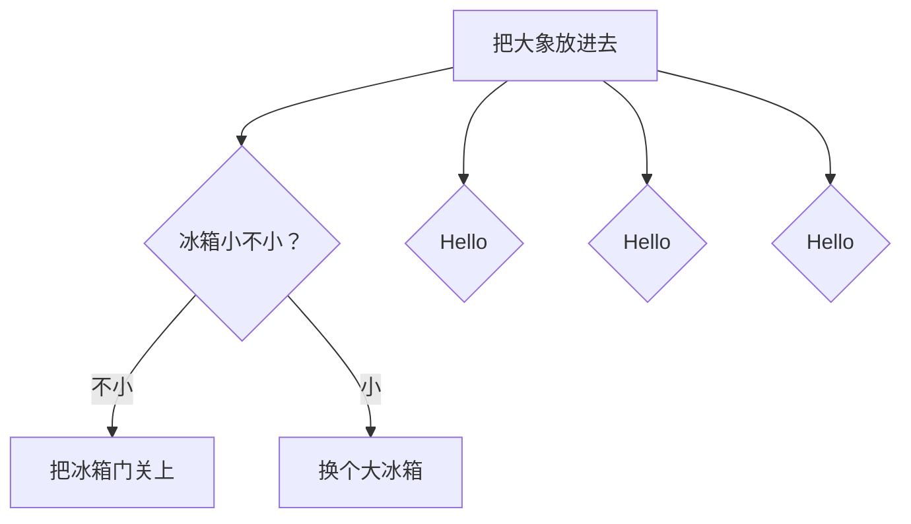

# 怎么实现fork

## v1

### 函数原型

函数原型：`int fork()`。

调用`fork`一次，产生两个结果。

当结果是0时，是子进程；当结果是父进程。伪代码如下：

```shell
int pid = fork()
if(pid == 0){
			// 子进程
}else{
			// 父进程
}
```

### 实现方法

#### 流程

1. 在存储进程表的数组`proc_table`中预留N个空闲进程表。
2. 调用fork后，在`proc_table`中找到一个空闲进程表，把这个空闲进程表记作`free_proc`。
3. 把父进程的进程表复制到`free_proc`，修改`free_proc`的`ldt_sel`。
   1. `ldt_sel`是指向进程的LDT表的GDT选择子。
      1. 这是什么意思？
         1. 根据`ldt_sel`在GDT中找到对应的描述符，根据描述符找到对应的内存空间。这个内存空间就是进程的LDT。
   2. 为什么要修改`free_proc`的`ldt_sel`。
      1. 父进程的进程表的`ldt_sel`指向的LDT在父进程的进程表中。
      2. 如果不修改，子进程的进程表的`ldt_sel`指向的LDT仍然在父进程的进程表中。
      3. 子进程是一个独立的进程，有自己独立的内存空间，自然不能使用父进程的内存空间。
   3. 怎么修改`free_proc`的`ldt_sel`？
      1. 初始化每个进程时，进程表中的`ldt_sel`已经设置好了。
      2. 只需在把父进程的进程表中的数据复制到子进程的进程表中之前把子进程的`ldt_sel`用临时变量保存起来，等复制结束后，再把之前的`ldt_sel`赋值给`free_proc`的`ldt_sel`即可。
   4. 怎么把父进程的进程表复制到子进程的进程表？这是重点，请看下一个小结。
4. 把`free_proc`标记成非空闲状态。
5. 把`free_proc`的`parent_pid`设置成父进程的pid。
6. 这个和父进程的进程表高度相似的`free_proc`会和进程表数组中的其他一起被进程调度程序调度。

#### 复制进程表

##### 怎么实现复制

伪代码如下：

```html
// 空闲进程表
struct proc * free_proc;
for(遍历进程表数组)
  	// 找到第一个空闲进程表
  	free_proc = 第一个空闲进程表的内存地址
*free_proc = 父进程的进程表中的数据
```

伪代码并没有准确地表达好复制进程表的过程。复制进程表，使用的指针。

为什么单独讲解这个过程？因为我读于渊老师的代码时，在这里消耗的时间最多。

创建指针标量表示空闲进程表，`struct proc * free_proc;`。

如果父进程的进程表是`struct proc parent_proc`，把父进程的进程表复制给子进程的语句是下面这句，

```c
free_proc = &parent_proc;
```

不是下面这句。

```c
*free_proc = parent_proc;
```

可以用这个例子来理解。

```c
#include <stdio.h>

struct Person{
        int age;
        char name[20];
};

int main(int argc, char **argv)
{
        struct Person people[20];
        struct Person * jim = people;
        struct Person * jim2 = &people[1];
        struct Person kate = {19, "Lily"};
        struct Person kate2 = {29, "Lucy"};
        jim = &kate;
        printf("kate name:%s, age:%d\n", kate.name, kate.age);
        jim->age = 190;
        printf("kate name:%s, age:%d\n", kate.name, kate.age);

        *jim2 = kate2;
        printf("kate2 name:%s, age:%d\n", kate2.name, kate2.age);
        jim2->age = 180;
        printf("kate2 name:%s, age:%d\n", kate2.name, kate2.age);

        return 0;
}
```

执行结果是：

```shell
kate name:Lily, age:19
kate name:Lily, age:190
kate2 name:Lucy, age:29
kate2 name:Lucy, age:29
```

从执行结果，可以看出：

1. 使用`jim = &kate;`，修改`jim`后，`kate`也会被修改。
2. 使用`*jim2 = kate2;`，修改`jim`后，`kate`不受影响。

我们把父进程的进程表复制到子进程的进程表后，无论修改二个进程表中的哪一个，都不应该影响另外一个。因此，复制进程表应该使用的语句类似`*jim2 = kate2;`。

##### 原理解析

在上面的代码中，`jim = &kate;` 和 `*jim2 = kate2;` 有什么不同？

`jim`的数据类型是`struct Person *`。显然，这是一个指针变量。指针变量的值应该是一个内存地址。

`jim2`的数据类型和`jim`相同。但是，`*jim2`表示的却是`jim2`这个指针变量指向的那个内存地址中存储的数据。

用一个图表示`jim`和`*jim2`。

| 内存地址 | 0x0  | 0x1  | 0x2                   | 0x3   | 0x4  | 0x5   |
| -------- | ---- | ---- | --------------------- | ----- | ---- | ----- |
| 变量     |      | jim  | jim2                  |       | kate | kate2 |
| 变量值   |      | 0x4  | 某个内存地址，例如0x3 | kate2 | kate | kate2 |

在图中的场景下，`*jim2 = kate2`的含义是：

1. `*jim2`的值是内存地址为0x3的内存空间。
2. `*jim2 = kate2`，在内存地址为0x3的内存空间中存放kate2。

显而易见，修改`*jim2`，其实就是修改内存地址为0x3的内存空间中的数据，完全不会影响内存地址为0x5的内存空间中的数据。

## v2


## 小结

### 2021-06-11 19:04

复述fork的实现过程。耗时40分。

一寸光阴一寸金。如今的时间，都是我用非常昂贵的代价换来的。不要肆意浪费生命。事情虽然多，也有很多不起眼的事情，但只要我一件件去做，总会在看得见的时间内做完。

### 2021-06-11 23:01

写‘fork的实现“草稿。耗时2个小时20分。

我做了什么？

1. 写这篇文章。耗费最多时间。
   1. 写文章。
   2. 写代码测试指针的使用。
2. 发布到公众号并查看。

我写的这篇文章，不好。一，关键细节没有写出来。例如，修改子进程的LDT。子进程的LDT中有两个描述符，涉及进程的地址空间，我没有弄明白，也没有写出来。二，读者看不懂。三，读了这篇文章，读者仍然不能实现fork。

写文章，不要搞花架子，发布到公众号只是增加趣味性，不值得花过多时间。这个阶段，是如此。

等我实现了操作系统的全部功能，我会写一个操作系统的系列文章。

微信排版工具，真不错。

https://editor.mdnice.com/?outId=5d259952ea1a40c69da8e378adcc67ef

### 2021-06-12 10:16

逐行给do_fork写注释。耗时1个小时30分钟。很顺利。

我不知道怎么完成剩余的内存管理和文件系统开发。写文章？感觉不踏实。

先给所有代码逐行写上注释吧。

### 2021-06-12 10:16

逐行给do_exit写注释。耗时1小时38分。很顺利。

### 2021-06-12 11:11

逐行给do_wait写注释。耗时13分。很顺利。

## 画流程图

### 文档

https://zhuanlan.zhihu.com/p/69495726

输入代码的时候选择`mermaid`。





mdnice

Pwd:sdfyu62ho