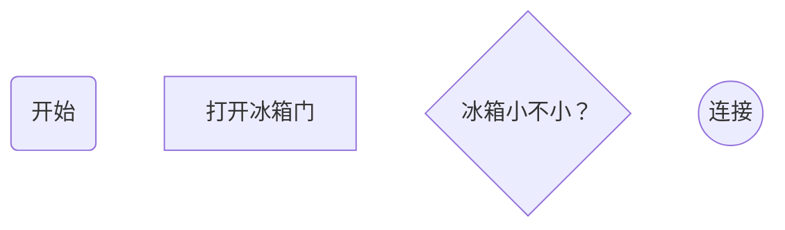
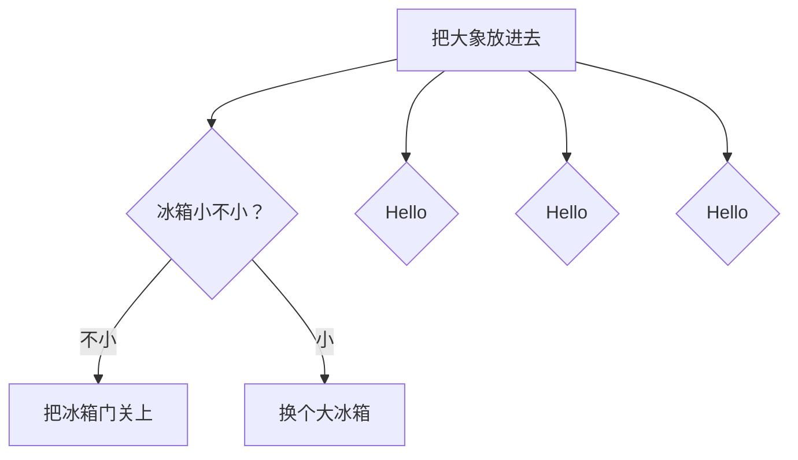

# 怎么实现fork

## 画流程图

### 文档

https://zhuanlan.zhihu.com/p/69495726

输入代码的时候选择`mermaid`。

```mermaid
graph TB
    A(开始)
    B[打开冰箱门]
    C{"冰箱小不小？"}
    D((连接))
```

```mermaid
graph TB
    A[把大象放进去] --> B{"冰箱小不小？"}
    B -->|不小| C[把冰箱门关上]
    B -->|小| D[换个大冰箱]
    A --> M{"Hello"}
    A --> N{"Hello"}
    A --> O{"Hello"}
```

