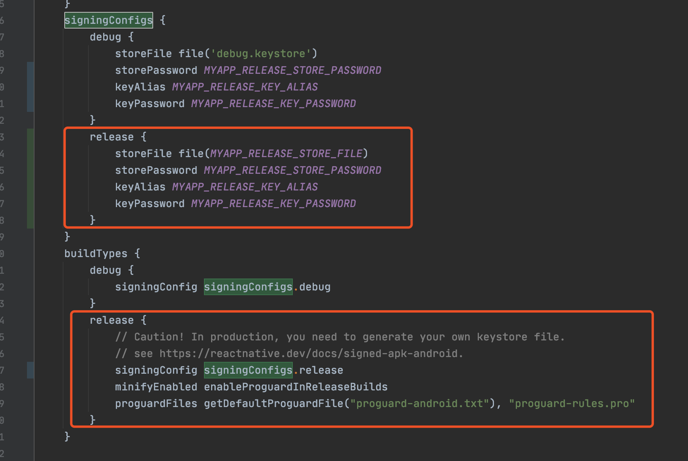

# 打包安卓App

## 产生签名的key

```shell
# 在产生的时候需要提供密钥和存储密码，后续会用到
keytool -genkey -v -keystore my-release-key.keystore -alias my-key-alias -keyalg RSA -keysize 2048 -validity 10000
mv my-release-key.keystore android/app/
```

## 设置秘钥密码

修改android/gradle.properties文件。

```text
MYAPP_RELEASE_STORE_FILE=my-release-key.keystore
MYAPP_RELEASE_KEY_ALIAS=my-key-alias
MYAPP_RELEASE_STORE_PASSWORD=xx
MYAPP_RELEASE_KEY_PASSWORD=xx
[注意替换xx为你自己设置的密钥和存储密码]
```

例如，在我的电脑上，操作是下面这样的。

在`/Users/cg/data/code/react-native/react-im/android/gradle.properties`中加入

```text
MYAPP_RELEASE_STORE_FILE=my-release-key.keystore
MYAPP_RELEASE_KEY_ALIAS=my-key-alias
MYAPP_RELEASE_STORE_PASSWORD=123456
MYAPP_RELEASE_KEY_PASSWORD=123456
```

在执行第一步时，对密码相关的选项设置的是`123456`。

修改`/Users/cg/data/code/react-native/react-im/android/app/build.gradle`文件中的签名配置，显示出来的是新增的代码：

```text
...
android { 
  ... 
  defaultConfig { 
    ... 
  } 
  signingConfigs { 
    release { 
        storeFile file(MYAPP_RELEASE_STORE_FILE) 
        storePassword MYAPP_RELEASE_STORE_PASSWORD 
        keyAlias MYAPP_RELEASE_KEY_ALIAS 
        keyPassword MYAPP_RELEASE_KEY_PASSWORD 
    } 
  } 
  buildTypes { 
    release { 
      ... 
      signingConfig signingConfigs.release 
    } 
  }
}
```

下图中的红框中的代码，是新增的代码。



## 生成apk

进入`/Users/cg/data/code/react-native/react-im/android`目录执行下面的命令：

```text
./gradlew assembleRelease
```

执行成功后，会生成apk文件

`/Users/cg/data/code/react-native/react-im/android/app/build/outputs/apk/release/app-release.apk`

每次执行前，注意将该apk删除。

